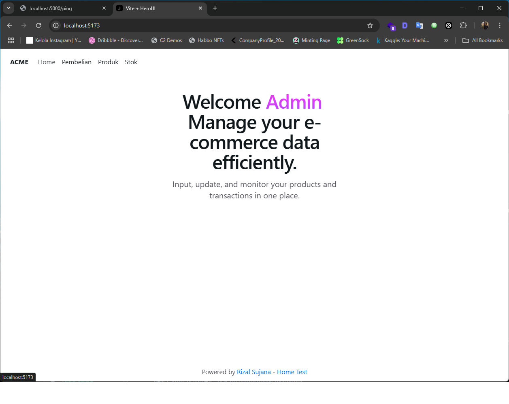
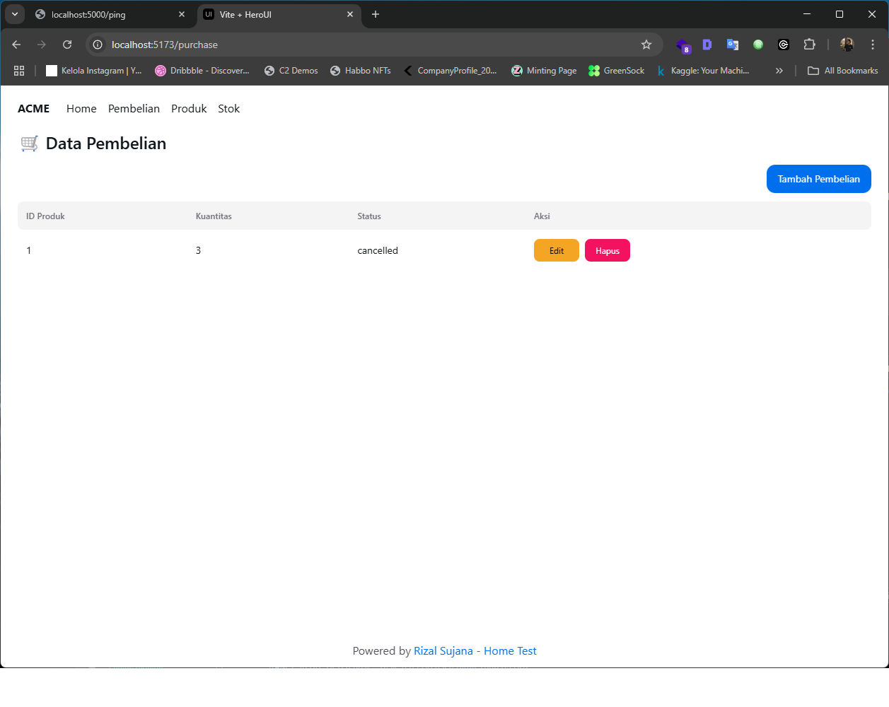
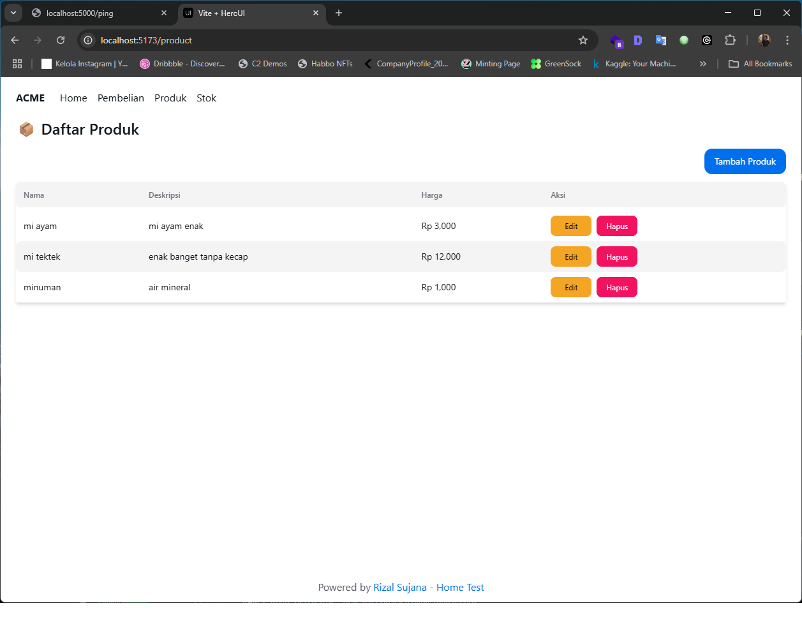
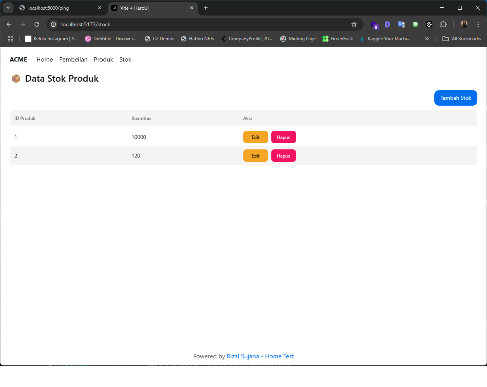

# Stock Management API

## Deskripsi
Aplikasi Stock Management ini memungkinkan Anda untuk mengelola data stok produk dengan mudah. Anda dapat menambah, mengedit, dan menghapus stok produk menggunakan API berbasis Express.js. Frontend aplikasi ini dapat menggunakan React atau Vue untuk interaksi pengguna.

## Fitur
- Menambah stok produk
- Mengedit data stok produk
- Menghapus produk dari stok
- API berbasis Express.js
- Frontend berbasis React atau Vue

## Screenshot





## Instalasi

### Backend (Express.js)

1. Clone repositori:

    ```bash
    git clone https://github.com/username/repository.git
    cd repository
    ```

2. Instal dependensi:

    ```bash
    npm install
    ```

3. Jalankan server:

    ```bash
    npm start
    ```

    Server akan berjalan di `http://localhost:5000`.

### Frontend (React / Vue)

1. Clone repositori frontend:

    ```bash
    git clone https://github.com/username/frontend-react.git
    cd frontend-react
    ```

2. Instal dependensi:

    ```bash
    npm install
    ```

3. Jalankan aplikasi frontend:

    ```bash
    npm start
    ```

    Aplikasi frontend akan berjalan di `http://localhost:3000`.

## Docker

Untuk menjalankan aplikasi ini dalam Docker, ikuti langkah-langkah berikut:

1. Membangun image Docker:

    ```bash
    docker build -t stock-management .
    ```

2. Menjalankan container:

    ```bash
    docker run -p 5000:5000 stock-management
    ```

    Aplikasi akan berjalan di `http://localhost:5000`.

## Teknologi yang Digunakan

- Backend: Express.js
- Frontend: React / Vue
- Docker untuk containerization


## Rute Autentikasi

### Login

- **URL**: `/api/login`
- **Metode**: `POST`
- **Deskripsi**: Mengautentikasi pengguna dan menghasilkan token autentikasi.
- **Request Body**:
  - `email`: Email pengguna (string)
  - `password`: Kata sandi pengguna (string)

### Register

- **URL**: `/api/register`
- **Metode**: `POST`
- **Deskripsi**: Mendaftarkan pengguna baru.
- **Request Body**:
  - `email`: Email pengguna (string)
  - `password`: Kata sandi pengguna (string)

### Logout

- **URL**: `/api/logout`
- **Metode**: `GET`
- **Deskripsi**: Mengeluarkan pengguna dengan menginvalidasi token autentikasi mereka.
- **Autentikasi Diperlukan**: Ya

## Rute Produk

### Mendapatkan Semua Produk

- **URL**: `/api/products`
- **Metode**: `GET`
- **Deskripsi**: Mengambil daftar semua produk dalam sistem.
- **Autentikasi Diperlukan**: Ya

### Membuat Produk

- **URL**: `/api/products`
- **Metode**: `POST`
- **Deskripsi**: Menambahkan produk baru ke dalam sistem.
- **Autentikasi Diperlukan**: Ya
- **Request Body**:
  - `nama`: Nama produk (string)
  - `deskripsi`: Deskripsi produk (string)
  - `harga`: Harga produk (number)

### Memperbarui Produk

- **URL**: `/api/products/{id}`
- **Metode**: `PUT`
- **Deskripsi**: Memperbarui produk yang ada berdasarkan ID-nya.
- **Autentikasi Diperlukan**: Ya
- **Request Body**:
  - `nama`: Nama produk (string)
  - `deskripsi`: Deskripsi produk (string)
  - `harga`: Harga produk (number)

### Menghapus Produk

- **URL**: `/api/products/{id}`
- **Metode**: `DELETE`
- **Deskripsi**: Menghapus produk berdasarkan ID-nya.
- **Autentikasi Diperlukan**: Ya

## Rute Stok

### Mendapatkan Semua Stok

- **URL**: `/api/stock`
- **Metode**: `GET`
- **Deskripsi**: Mengambil daftar semua stok produk.
- **Autentikasi Diperlukan**: Ya

### Menambahkan Stok

- **URL**: `/api/stock`
- **Metode**: `POST`
- **Deskripsi**: Menambahkan stok untuk produk dalam sistem.
- **Autentikasi Diperlukan**: Ya
- **Request Body**:
  - `produk_id`: ID produk (integer)
  - `kuantitas`: Jumlah stok yang tersedia (integer)

### Memperbarui Stok

- **URL**: `/api/stock/{id}`
- **Metode**: `PUT`
- **Deskripsi**: Memperbarui jumlah stok untuk produk tertentu berdasarkan ID-nya.
- **Autentikasi Diperlukan**: Ya
- **Request Body**:
  - `produk_id`: ID produk (integer)
  - `kuantitas`: Jumlah stok yang diperbarui (integer)

### Menghapus Stok

- **URL**: `/api/stock/{id}`
- **Metode**: `DELETE`
- **Deskripsi**: Menghapus entri stok untuk produk tertentu berdasarkan ID-nya.
- **Autentikasi Diperlukan**: Ya

## Rute Pembelian

### Membuat Pembelian

- **URL**: `/api/pembelian`
- **Metode**: `POST`
- **Deskripsi**: Membuat transaksi pembelian baru.
- **Request Body**:
  - `produk_id`: ID produk yang dibeli (integer)
  - `kuantitas`: Jumlah produk yang dibeli (integer)
  - `status`: Status pembelian (string: `pending`, `completed`, dll.)

### Mendapatkan Semua Pembelian

- **URL**: `/api/pembelian`
- **Metode**: `GET`
- **Deskripsi**: Mengambil daftar semua transaksi pembelian.
- **Autentikasi Diperlukan**: Ya

### Memperbarui Pembelian

- **URL**: `/api/pembelian/{id}`
- **Metode**: `PUT`
- **Deskripsi**: Memperbarui transaksi pembelian yang ada berdasarkan ID-nya.
- **Autentikasi Diperlukan**: Ya
- **Request Body**:
  - `produk_id`: ID produk (integer)
  - `kuantitas`: Jumlah pembelian yang diperbarui (integer)
  - `status`: Status pembelian yang diperbarui (string)

### Menghapus Pembelian

- **URL**: `/api/pembelian/{id}`
- **Metode**: `DELETE`
- **Deskripsi**: Menghapus transaksi pembelian tertentu berdasarkan ID-nya.
- **Autentikasi Diperlukan**: Ya

## Respons Error

- **400 Bad Request**: Permintaan tidak valid, silakan periksa body permintaan atau parameter.
- **401 Unauthorized**: Autentikasi diperlukan atau gagal.
- **404 Not Found**: Sumber daya yang diminta tidak ditemukan.
- **500 Internal Server Error**: Terjadi kesalahan di server.

## Kesimpulan

Dokumentasi ini memberikan informasi yang diperlukan untuk berinteraksi dengan API Manajemen Stok. Pastikan untuk menyediakan token autentikasi yang sesuai untuk rute-rute yang memerlukan autentikasi. Untuk informasi lebih lanjut atau kontribusi, silakan hubungi pemelihara API.


## Pembuat

- **Nama**: [Rizal Sujana](https://github.com/rabbitdev)
- **Email**: zalsujana07@email.com
- **linkeid**: Rizal Sujana

## Lisensi

Proyek ini dilisensikan di bawah lisensi MIT. Lihat file [LICENSE](LICENSE) untuk detail lebih lanjut.


